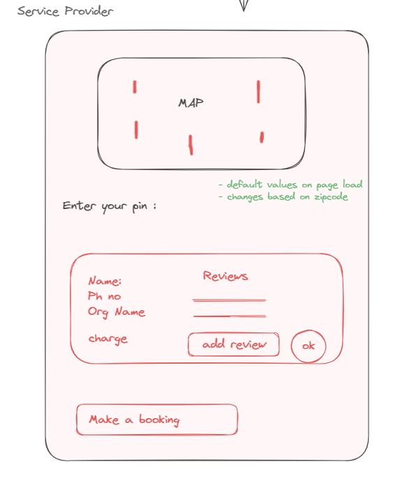

# Project Title
Service Buddy

## Overview

Service Buddy is to empower users with swift access to home services, which enables hassle-free requests for various home-related needs. Users can effortlessly connect with service providers by either raising a request or accessing contact details directly. The goal is to provide a fast and easy solution, making essential home services readily available to users.

### Problem

In our fast-paced lives, finding time for home maintenance is a challenge. Unexpected issues like plumbing or electrical problems add stress as users struggle to find immediate help. Difficulty in accessing contact details and reviews for local service providers compounds the problem. This platform addresses these challenges, providing a convenient, reliable solution for users to efficiently manage their home-related concerns.

### User Profile

- Users looking for home related services.
- Verified users who are willing to provide their service.

### Features

- As a user, I want to be able to search for available services .
- As a user, I want to be able to create an account and manage the bookings I have made. 
- As a user, I want to be able to see the service providers closest to my location, their reviews and contact information.
- As a user, I want to be able to book services for a scheduled time.

- Any users can view the services and the service providers near their location. Data set is limited to Vancouver area of BC for this sprint.
- A User can Login/Register either at the landing page or at the time of booking a service.
- Logged in user can : 
	-Make a booking
	-Favorite the Professional
	-View the dashboard
	-Manage bookings, edit user profile & view favorites.

## Implementation

### Tech Stack

- React
- MySQL
- Express
- Client libraries: 
    - react
    - react-router
    - axios
    -  scss
    - react-map-gl
- Server libraries:
    - knex
    - express
    - cors
    - mysql2

### APIs

Use MapBoxAPI to access map view. Require access token.

### Sitemap

- Home page
- Services deatils
- Provider details
- Booking
- User Dashboard

### Mockups
**Home Page**


**Service details Page**


**Provider details**



**Booking page**


**User-login page**


**User-register page**


### Project Demo


### Data
**Database Relationship**


### Endpoints

**GET /services**
- Get list of services

Response: 
```
[
    {
        "id": 1,
        "name": "Kitchen Cleaning"
    },
]
```
**GET /services/:id**
- Get details of a particular service

Parameter:
- id : service id

Response: 
```
{
    "id" : 1,
    "service_name" : Plumbing,
    "description" : "Expert plumbing solutions tailored to your needs. From repairs and installations to maintenance and emergency services, we deliver reliable and efficient plumbing solutions to keep your home or business running smoothly."
},
```

**GET /providers**
- Get list of service providers in the vacinity

Response: 
```
[
    {
        "id" : 1,
        "service_id" : 1,
        "name" : "Riana"
        "contact_info" : +1 123 409-45690,
        "email" : "riana100@gmail.com",
        "rating": 4.5
    },
]
```
**GET /providers/:id/**
- Get data of a particular provider

Parameter:
- id : provider id 

Response: 
```
{
    "id" : 1,
    "service_id" : 1,
    "name" : "Riana"
    "contact_info" : +1 123 409-45690,
    "email" : "riana100@gmail.com",
    "rating": 4.5
},
```
**POST /providers/:id/reviews**
- Post a review for the provider with provider id

Parameter:
-id : provider id

Request body:
```
{
    "id" : 1,
    "name" : "Anna",
    "description": "Best service!",
    "timestamp": new Date()
}
```
Response: 
```
{
    "id" : 1,
    "name" : "Anna",
    "description": "Best service!",
    "timestamp": Timestamp
},
```
**POST /users/register**

- Add a user account

Parameters:

- email: User's email
- password: User's provided password

Request body:
```
{
    "id" : 1,
    "name" : "Richard",
    "email": "richard@gmail.com",
    "password": "**********"
}
```

**POST /booking/:serviceId/:providerId/:userId**
- Confirm the booking on submit form.

Paramters:
- service id : id of the selected service
- provider id : id of the provider selected
- userid : id of the user making request

Response body:
```
{
    "booking_id" : 1,
    "message" : "Your booking is confirmed with <name of provider> on <date> "
}
```

**DELETE /booking/:serviceId/:providerId/:userId**
- Confirm the booking on submit form.

Paramters:
- service id : id of the selected service
- provider id : id of the provider selected
- userid : id of the user 


### Auth

- Nice to have: JWT auth
- To be considered after functionalities are implemented

## Roadmap

- Create client
    - react project with routes and boilerplate pages

- Create server
    - express project with routing, with placeholder 200 responses

- Create migrations

- Gather dummy data for users, providers, services

- Create seeds with sample data

- Deploy client and server projects so all commits will be reflected in production

- Feature: List services provided
    - Implement services page with cards containing types of services
    - Create GET /services endpoint

- Feature: View service
    - Implement service details page 
    - Create GET /services/:id endpoint

- Feature: Providers in the vicinity
    - Add an input field to enter location
    - Nice to have: A map view with markers pointing service providers in the area. 
    - List the suitable services providers
    - Get /providers/:serviceId/:location

- Feature: View provider
    - View the services provider details
    - Display exisitng reviews
    - Get /providers/:id
    - Get /reviews/:providerId
    
- Feature: Booking page
     - Form for booking
     - Create POST /bookings
     - Add & delete bookings 
     - Booking confirmation message on successful booking

- Feature: Login
    - Implement login page + form
    - Create POST /users/login endpoint

- Bug fixes

## Nice-to-haves

- Implement JWT tokens
- Integrate Map view
- Ability for users to upload images.
- Ability to login as Service providers and view dashboard.

## Install with npm

- npm install
- npm start